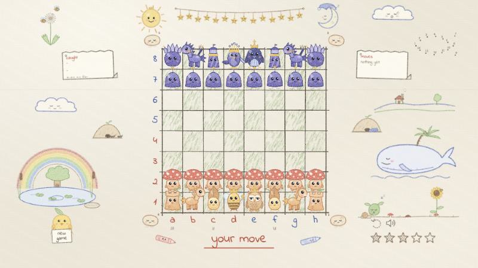
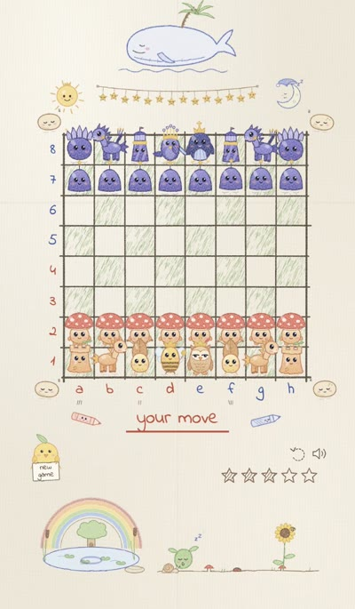

# Toadstool Chess

Chess drawn in coloured pencil. Toadstools, ponies, leaf beetles, a honeybee
queen and a deadpan owl king take on a twilight crew of crystal-crowned
berries, turret-hatted heralds and a penguin king, on a sheet of paper full
of doodles that live their own little lives while you play.

No framework, no build step, no dependencies: open `index.html` and play.

<p align="center">
  
</p>

<p align="center">
  
</p>

## Features

- **Real chess.** Every rule: castling, en passant, promotion, check,
  checkmate, stalemate, the fifty-move rule and insufficient material. The
  move generator matches the standard perft results to depth 4.
- **An opponent with five strengths**, set with the five stars: from a sleepy
  one that grabs whatever it sees to one that searches deeper against a clock.
- **Characters that are alive.** Every drawing shimmers at 8 frames a second
  like traced animation. Pieces breathe, blink, yawn, look round, giggle and
  doze off, and their eyes follow your pointer. Pick one up and it jumps for
  joy; the pieces you could take look worried; a king in check sweats.
- **Moves you can watch.** Pieces hop square by square (knights in an L),
  crouch and stretch, kick up dust and leave footprints in their team's
  colour. A captured piece goes dizzy, sees stars, tumbles and vanishes in a
  poof, while the winner cheers and the neighbours jump.
- **A page that joins in.** The sun laughs at your captures and gasps at the
  opponent's, a snail crawls across the garden as the game goes on, and a
  dot-to-dot fish joins up one line per move. The whale, the moon, the clouds
  and the sprout in the garden doze in the margins.
- **Fits any window.** Landscape or portrait, phone to 4K, never a scrollbar.

## Play

Open `index.html` in a browser, or serve the folder:

```bash
python3 -m http.server 4173
```

and visit <http://localhost:4173>.

- Click a piece to pick it up. Legal squares get a gold circle with a leaf;
  click one to move there. `Esc` puts the piece back down.
- The **chick's sign** starts a new game, the **dashed arrow** takes back
  your last move, the **speaker** turns the sound on and off, and the **five
  stars** set the opponent's strength.
- The sticky notes keep the latest moves and what each side has caught.

## Publish it with GitHub Pages

It is a static site, so GitHub Pages can host it as is: in the repository go
to **Settings → Pages**, choose **Deploy from a branch**, pick `master` and
`/ (root)`, and save. The game appears at
`https://<your-username>.github.io/toadstool-chess/`.

## How it's built

| File | What it does |
| --- | --- |
| `js/engine.js` | The rules: move generation, check, castling, en passant, promotion, draws, notation. |
| `js/ai.js` | Alpha-beta search with piece-square tables and a quiescence pass. The fifth star deepens the search until a 2.2-second clock runs out. |
| `js/pencil.js` | Bakes any drawing into three wobbly coloured-pencil frames that "boil" like hand-drawn animation. |
| `js/pieces.js` | The cast. Each piece is a boiling pencil body with a live inked face on top that has five moods. |
| `js/marks.js` | Hand-drawn overlays: move circles, hover brackets, emotes, dust, and the knockout's spirals, stars and poof. |
| `js/world.js`, `js/world-land.js` | The doodles round the board. |
| `js/world-mount.js` | Puts the doodles on the page and lets the game talk to them. |
| `js/app.js` | The board, moves and their animation, the opponent's turn, moods and idle acts, and the controls. |
| `css/styles.css`, `css/world.css` | The board and pieces; the sheet layout and every doodle's motion. |

### The coloured-pencil look

All the artwork is drawn in SVG code and run through one pencil filter: edges
wobble, a streaky grain lets the paper show through, and each drawing sits on
its own patch of paper. `pencil.js` bakes every drawing into three images
with a slightly different wobble and flicks between them eight times a
second, which is what makes everything shimmer. The filter runs once per
image, never per frame, and identical drawings share one image, so the
shimmer costs almost nothing.

### How the characters come alive

A piece's face is drawn live over its baked body, so it can blink, look
around and change expression cheaply. Which face it pulls comes from three
layers, strongest first:

1. **What the board says**: picked up, threatened, or in check.
2. **A passing reaction**: startled by a neighbour landing, or cheering a capture.
3. **Idleness**: every couple of seconds someone with nothing to do yawns,
   looks round, giggles, stretches or nods off.

Movement uses the Web Animations API for the hops and CSS transforms for
almost everything else, so nearly all of it runs on the GPU.

### Adding artwork

New drawings should go through the same pipeline so the page keeps one
style: draw the SVG, bake it with `Pencil.layers`, and animate the wrapper,
never the inside of a baked image. Asset URLs in `index.html` carry a `?v=`
number; bump it after changing CSS or JavaScript so browsers fetch the new
files.

## Credits

Inspired by [Ballpoint Gambit](https://ballpoint-gambit.vercel.app), a
beautiful hand-drawn chess game. All artwork here is drawn from scratch in
SVG code.

Handwriting font: [Indie Flower](https://fonts.google.com/specimen/Indie+Flower)
by Kimberly Geswein, loaded from Google Fonts.
